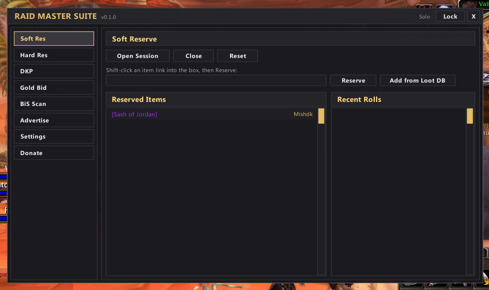
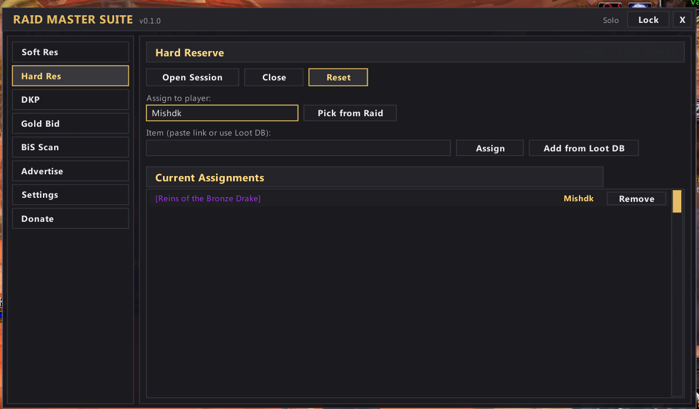
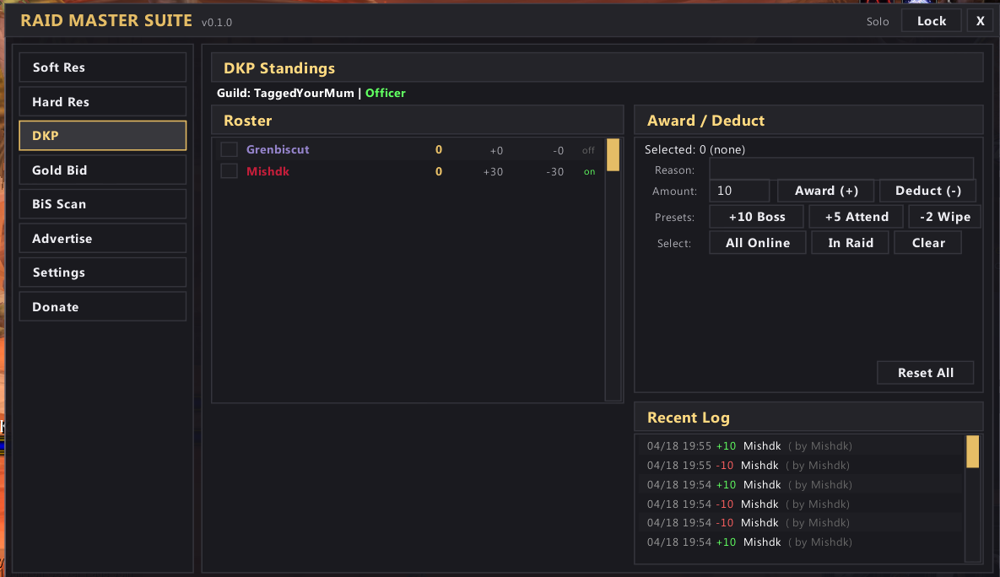
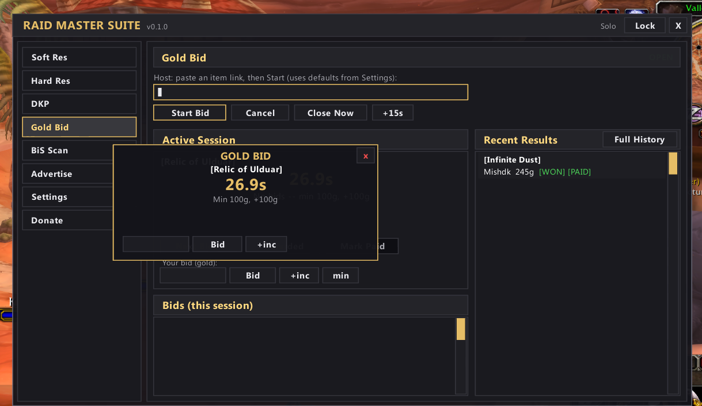
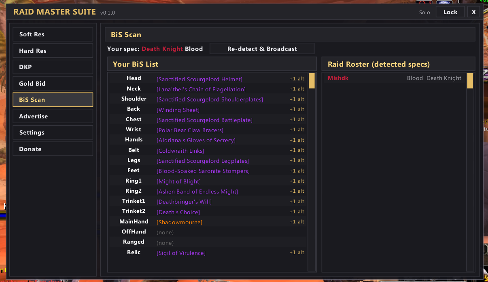
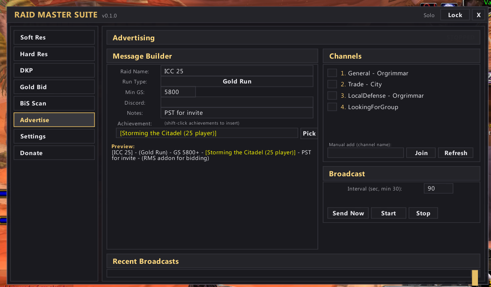
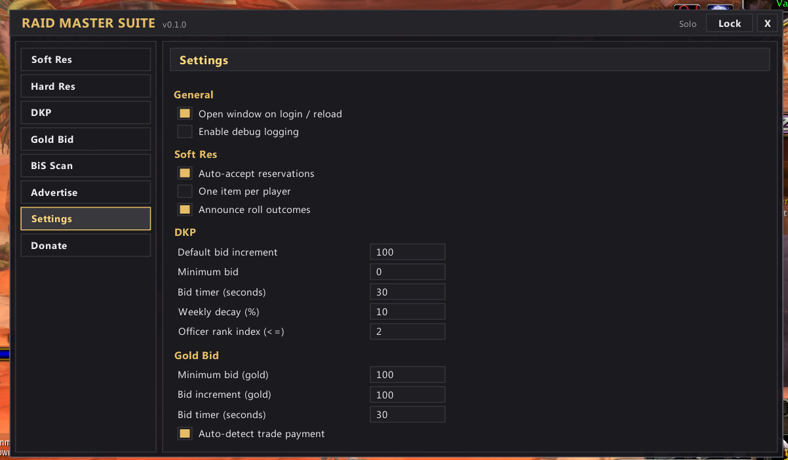
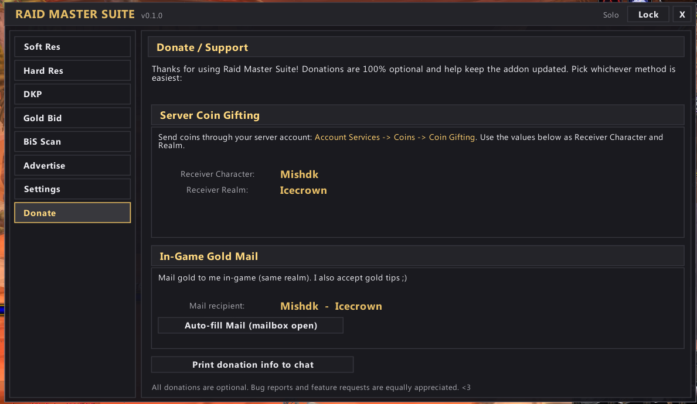

# Raid Master Suite

An all-in-one raid utility addon for **World of Warcraft 3.3.5a (WOTLK)**. Soft Res, Hard Res, DKP, Gold-bid auctions, BiS scanning, chat advertising, and more — bundled into a single dark/gold themed UI inspired by modern Zygor.

> **Status:** v0.1.0 — actively developed. Patches and feature requests welcome.
>
> **Repo:** https://github.com/advocaite/RaidMasterSuite — open an [Issue](https://github.com/advocaite/RaidMasterSuite/issues) for bugs / feature requests.

---

## Features

| Tab          | What it does                                                                                |
|--------------|---------------------------------------------------------------------------------------------|
| **Soft Res** | Players reserve items they want; SR holders get priority on `/roll`. Multi-item per player. |
| **Hard Res** | Leader pre-assigns items to specific players. Loot drop reminders for the master looter.    |
| **DKP**      | Per-guild standings, officer-managed award/deduct, presets, full audit log. GUILD-synced.   |
| **Gold Bid** | Live auction window for an item. Trade-window auto-detect of payment. Persistent history.   |
| **BiS Scan** | Detects each raider's class/spec, scans every loot drop, popup of who needs it.             |
| **Advertise**| Compose recruitment messages and broadcast to selected chat channels on a timer.            |
| **Settings** | All thresholds, defaults, and toggles (auto-open on login, etc.)                            |
| **Donate**   | How to support the author via server coin gifting or in-game gold mail.                     |

All raid-side features sync automatically over the **`RMS` addon channel** (RAID / PARTY) so every member running the addon sees the same state in real time. DKP uses the **GUILD** channel and is officer-gated.

---

## Screenshots

### Soft Res


### Hard Res


### DKP


### Gold Bid


### BiS Scan


### Advertise


### Settings


### Donate / Support


---

## Installation

1. Download / clone this repo into your `Interface/AddOns/` directory:
   ```
   World of Warcraft 3.3.5a/Interface/AddOns/RaidMasterSuite/
   ```
2. Launch WoW. The addon loads automatically.
3. Type `/rms` in chat to open the main window.

That's it — no Ace, no LibStub, no required deps. The addon is fully self-contained.

---

## Slash Commands

| Command                    | What it does                                |
|----------------------------|---------------------------------------------|
| `/rms` or `/raidmaster`    | Toggle the main window                      |
| `/rms config`              | Jump to the Settings tab                    |
| `/rms debug`               | Toggle verbose debug logging                |
| `/rms softres open`        | Open a Soft Res session (leader only)       |
| `/rms softres reset`       | Clear all reservations                      |
| `/rms goldbid <itemlink>`  | Start a Gold Bid for the linked item        |
| `/rms dkp sync`            | Force a DKP sync request to your guild      |
| `/rms bis test`            | Pop a sample BiS-needers popup              |
| `/rms advertising start`   | Start the advertising auto-broadcast loop   |
| `/rms donate chat`         | Print the donation info to your chat        |

---

## Module guide

### Soft Res
Players send their reservations to the raid via the addon channel. When the corresponding item drops and the raid does an open `/roll`, the addon collects rolls for ~8 seconds and announces the SR-weighted winner to RAID_WARNING (leader only). Reservations persist across reloads in `RaidMasterSuiteDB.softresState`. Late joiners auto-request the current session from the host.

### Hard Res
Leader pre-assigns specific items to specific players. When the master looter opens a corpse, the addon scans the loot vs. assignments and prints `HR [Item] -> PlayerName` so you know exactly who gets it. Picker integrated with the Loot DB (see below).

### DKP
- Per-guild standings stored at `RaidMasterSuiteDB.dkp[GuildName]`
- **Officer rank threshold** is configurable in Settings (default rank index `<=2`). Only officers can write changes.
- Award / Deduct supports multi-select with bulk helpers (`All Online`, `In Raid`).
- Presets: `+10 Boss Kill`, `+5 Attendance`, `-2 Wipe`. Easy to extend in code.
- Full action log preserved (capped at 500 entries).
- Late-join sync: officers respond to `syncreq` with chunked state pages.

### Gold Bid
- Master looter / raid leader pastes an item link, clicks **Start Bid**.
- Raiders see an auto-popup with item, countdown, current high bid.
- Configurable min bid, increment, and timer (in Settings).
- After timer expires, host trades the winner. Addon watches `TRADE_MONEY_CHANGED` / `UI_INFO_MESSAGE` and auto-confirms when the offered gold matches.
- If trade fails, host clicks **Next Bidder** → item is offered to runner-up.
- **Full History** browser: every past session saved (cap 200), with a **By Item** view showing avg / max / min sale price.

### BiS Scan
- Each raider's class+spec auto-detected from talent tab points.
- Specs broadcast over the addon channel so the whole raid knows.
- Seed data scraped from [WoWSims wotlk](https://github.com/wowsims/wotlk) Phase 4 (ICC) gear sets — 30 specs, all 18 slots.
- On `LOOT_OPENED`, scans every loot item against every raider's BiS list. Pops a window listing who needs what, color-coded by class.
- Per-row green ✓ tick if you already own the item (bags or equipped).
- `+N alt` badge per slot opens a popup listing all alternates with hover tooltips.

### Advertising
- Compose messages from structured fields (raid name, run type, min GS, achievement, discord, notes).
- **Achievement picker** pulls the **full WOTLK Dungeons & Raids achievement list** from the game's API at runtime, with search.
- Shift-click any achievement / item / quest in the game to insert into the achievement field.
- Auto-detects every chat channel you've joined (1–10). Manual add via **Join** input.
- **Send Now** for a one-shot, **Start Auto** to repeat at a configurable interval (min 30s).
- Recent broadcasts log preserved.

### Loot DB (used by SR & HR pickers)
- 16,966 items / 930 bosses / 212 instances generated from AtlasLoot data.
- Five expansion tabs: **WOTLK / TBC / Classic / Crafting / Events**.
- Live search filter.
- Item rows show full quality-colored links + on-hover wowhead tooltip + an action button (`Reserve` / `Unreserve` / `Assign` / `Remove`).
- Already-picked items are highlighted green so re-opening the picker shows your current state.

---

## File structure

```
RaidMasterSuite/
├── RaidMasterSuite.toc      # addon manifest
├── Core.lua                 # namespace, event router, slash commands
├── Skin.lua                 # widget factories (Panel, Button, EditBox, ScrollList...)
├── Comm.lua                 # addon-channel sync (RAID / PARTY / GUILD / WHISPER)
├── Config.lua               # SavedVariables defaults + Settings tab UI
├── UI.lua                   # main window + tab bar
├── LootPicker.lua           # reusable Expansion -> Instance -> Boss picker popup
├── Modules/
│   ├── SoftRes.lua
│   ├── HardRes.lua
│   ├── DKP.lua
│   ├── GoldBid.lua
│   ├── BiS.lua
│   ├── Advertising.lua
│   └── Donate.lua
├── Data/
│   ├── BiSData.lua          # auto-generated BiS seed (WoWSims P4)
│   └── LootDB.lua           # auto-generated loot DB (AtlasLoot)
├── Skin/                    # textures, fonts (subset borrowed from Zygor RM)
└── tools/                   # dev-only Python scrapers (not shipped to users; gitignored)
    ├── extract_lootdb.py
    └── extract_bis.py
```

---

## Re-generating data files

The two big data files in `Data/` are produced by the scripts in `tools/`. Re-run when you want a refresh:

```bash
cd RaidMasterSuite/
python tools/extract_lootdb.py    # rescrape AtlasLoot -> Data/LootDB.lua
python tools/extract_bis.py       # refetch WoWSims P4 -> Data/BiSData.lua
```

Both scripts produce CRLF-line-ending files (required for the WoW 3.3.5a Lua loader).

---

## SavedVariables

| Variable                 | Purpose                                                 |
|--------------------------|---------------------------------------------------------|
| `RaidMasterSuiteDB`      | Account-wide: settings, DKP per-guild, gold-bid history, etc. |
| `RaidMasterSuiteCharDB`  | Per-character: BiS overrides                            |

To reset all settings: `/console reload`-out, delete `WTF/Account/<acct>/SavedVariables/RaidMasterSuite.lua`, log back in.

---

## Credits / sources

- **AtlasLoot Enhanced** — original loot table data (locally extracted, no runtime dep)
- **WoWSims wotlk** ([github.com/wowsims/wotlk](https://github.com/wowsims/wotlk)) — BiS gear sets per spec/phase
- **Zygor Guides Viewer Remaster** — visual style inspiration; some textures borrowed
- Built for and tested on Warmane Icecrown.

---

## License

MIT. Use it, fork it, modify it, ship it. Attribution appreciated but not required.

---

## Support the project

If RMS makes your raid nights better, consider a tip — see the **Donate** tab in-game, or:

- **Server coin gifting:** Receiver `Mishdk` on `Icecrown` realm
- **In-game gold mail:** `Mishdk-Icecrown`

Bug reports and feature ideas are equally welcome. <3
