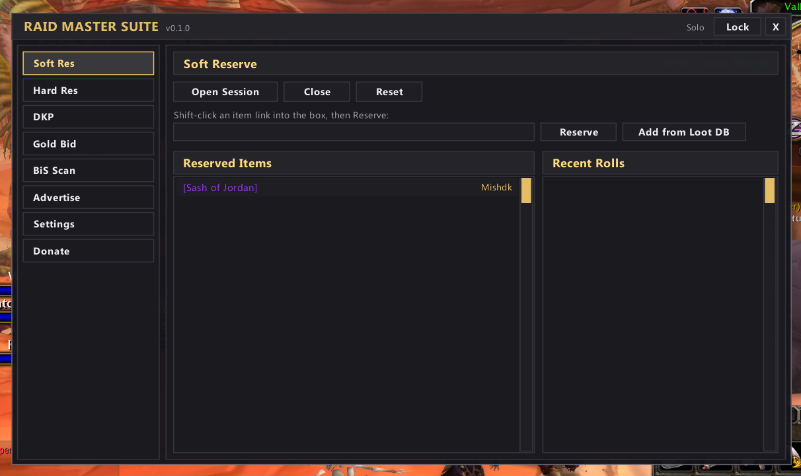
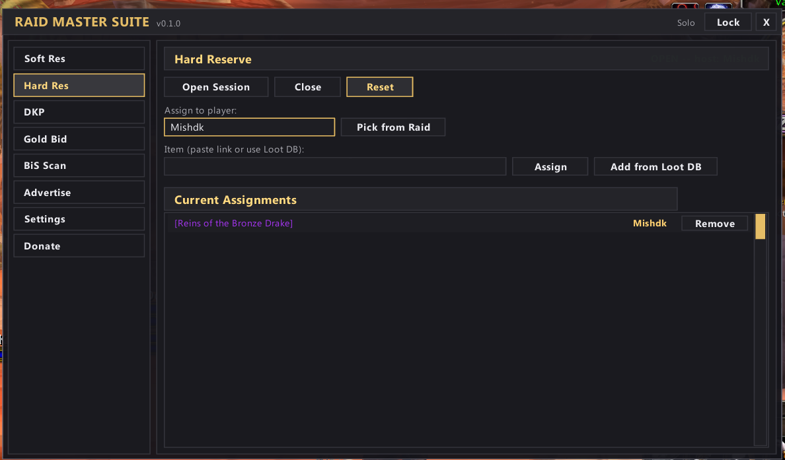
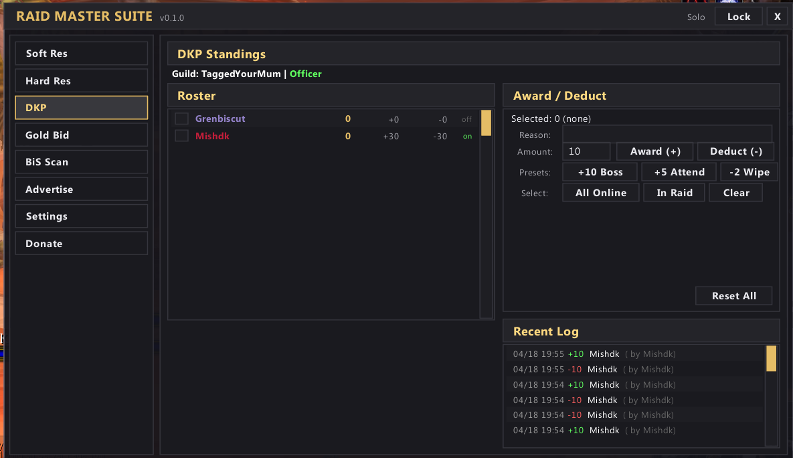
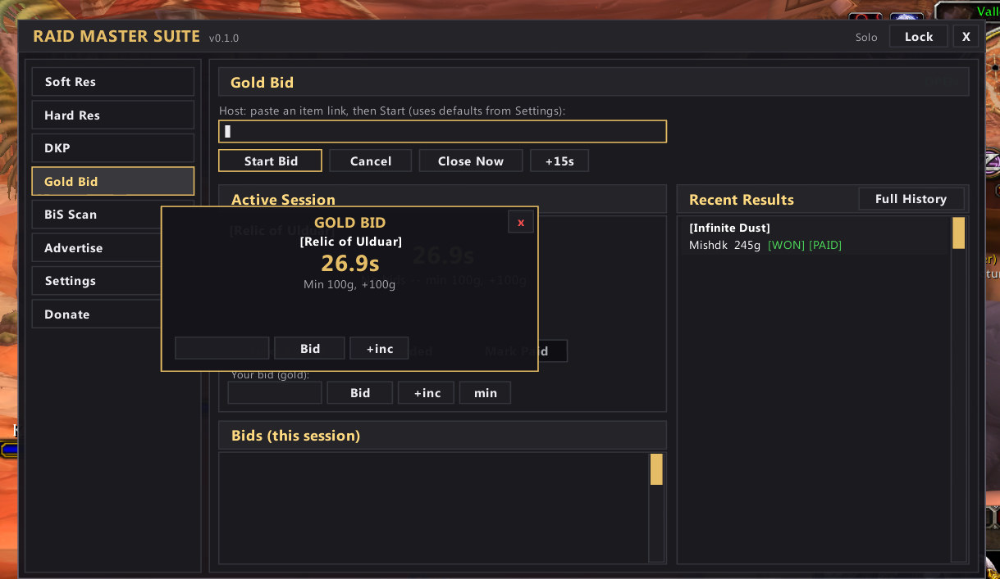
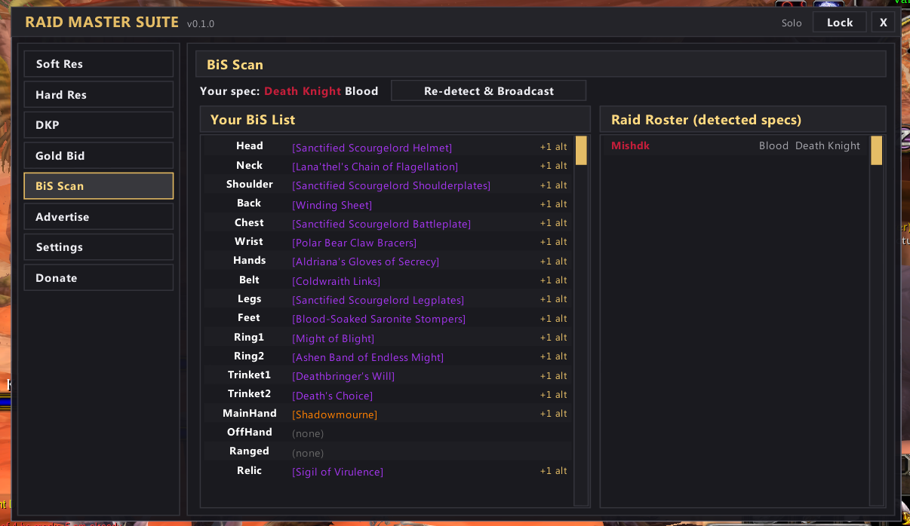
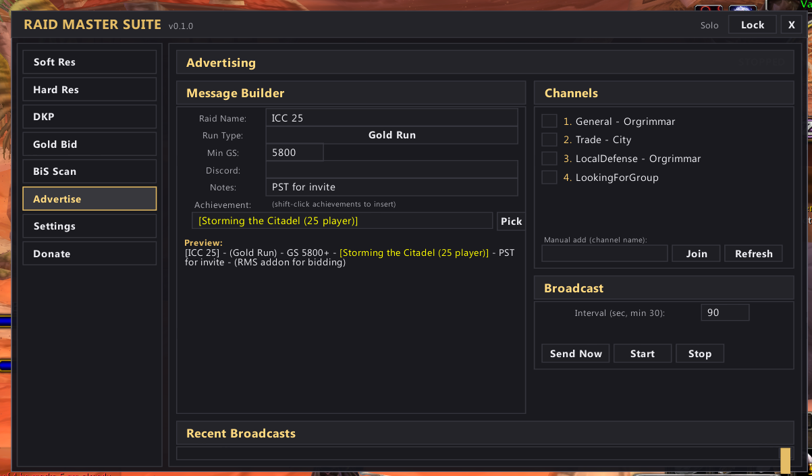
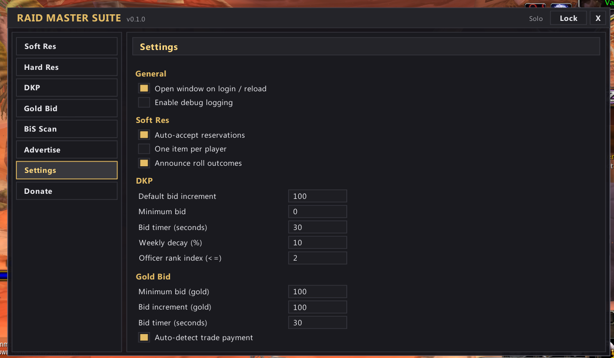
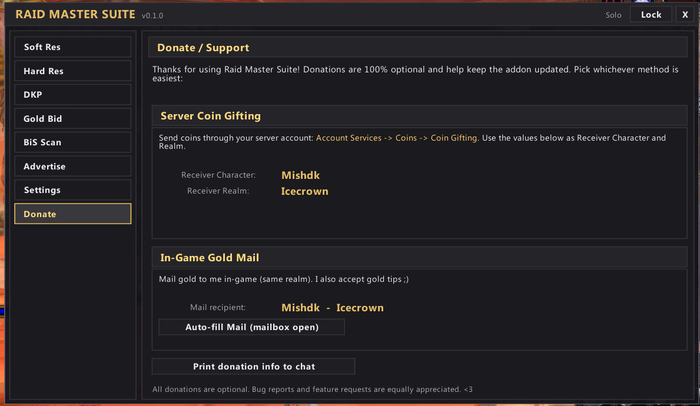

# Raid Master Suite

An all-in-one raid utility addon for **World of Warcraft 3.3.5a (WOTLK)**. Soft Res (with softres.it import), Hard Res, +1 loot tracking, master loot distribution with MS/OS/Transmog roll popups, a full GDKP suite, raid comp builder, DKP, BiS scanning, chat advertising, and more — bundled into a single dark/gold themed UI inspired by modern Zygor.

> **Status:** v0.5.0 — actively developed. Patches and feature requests welcome.
>
> **Repo:** https://github.com/advocaite/RaidMasterSuite — open an [Issue](https://github.com/advocaite/RaidMasterSuite/issues) for bugs / feature requests.

---

## Features

| Tab          | What it does                                                                                |
|--------------|---------------------------------------------------------------------------------------------|
| **Soft Res** | Players reserve items they want; SR holders get priority on `/roll`. Multi-item per player. |
| **Hard Res** | Leader pre-assigns items to specific players. Loot drop reminders for the master looter.    |
| **+1 Loot**  | Roll winners get marked +1 automatically; fewer +1s = higher priority. Raid-synced.         |
| **Master Loot** | Auto-popup for the ML with every drop above the loot threshold; candidates show +1 / BiS / SR / HR tags; call rolls and hand out loot in one click. |
| **Raid Comp** | Pick any WOTLK raid: typical GS ask, tank/healer/dps split, and a live buff & debuff coverage checklist vs your current group. |
| **DKP**      | Per-guild standings, officer-managed award/deduct, presets, full audit log. GUILD-synced.   |
| **Gold Bid** | Full GDKP toolkit: live auctions with chat bidding (no addon needed to bid), per-item start price/increment/stack, raid-wide pot tracking, cut / bonus-pool / split payout calculator, per-player budgets visible to leadership. |
| **BiS Scan** | Detects each raider's class/spec, scans every loot drop, popup of who needs it. Per-phase BiS lists (Pre-Raid → ICC). |
| **Advertise**| Structured ad builder: run type, GS, achievement links, reserved BOE/patterns/orbs, needed classes & role counts, live 255-char counter, timed auto-broadcast. |
| **Settings** | All thresholds, defaults, and toggles — plus a **Style** section (global window opacity slider, more coming). |
| **Donate**   | How to support the author via server coin gifting or in-game gold mail.                     |

All raid-side features sync automatically over the **`RMS` addon channel** (RAID / PARTY) so every member running the addon sees the same state in real time. DKP uses the **GUILD** channel and is officer-gated. A draggable **crown minimap button** toggles the window (left-click), opens Settings (right-click), and can be hidden in Settings.

---

## Screenshots

### Soft Res


### Hard Res


### DKP


### Gold Bid


### BiS Scan


### Advertise


### Settings


### Donate / Support


---

## Installation

1. Download / clone this repo into your `Interface/AddOns/` directory:
   ```
   World of Warcraft 3.3.5a/Interface/AddOns/RaidMasterSuite/
   ```
2. Launch WoW. The addon loads automatically.
3. Type `/rms` in chat to open the main window.

That's it — no Ace, no LibStub, no required deps. The addon is fully self-contained.

---

## Slash Commands

| Command                    | What it does                                |
|----------------------------|---------------------------------------------|
| `/rms` or `/raidmaster`    | Toggle the main window                      |
| `/rms config`              | Jump to the Settings tab                    |
| `/rms debug`               | Toggle verbose debug logging                |
| `/rms softres open`        | Open a Soft Res session (leader only)       |
| `/rms softres reset`       | Clear all reservations                      |
| `/rms goldbid <itemlink>`  | Start a Gold Bid for the linked item        |
| `/rms dkp sync`            | Force a DKP sync request to your guild      |
| `/rms bis test`            | Pop a sample BiS-needers popup              |
| `/rms bis phase 3`         | Switch BiS lists to phase 3 (0 = pre-raid)  |
| `/rms plusone <name> +1`   | Manually adjust a player's +1 count         |
| `/rms plusone reset`       | Reset all +1 counts (leader/assist)         |
| `/rms masterloot show`     | Open the master loot window (preview if no corpse open) |
| `/rms raidcomp`            | Open the Raid Comp builder                  |
| `/rms advertising start`   | Start the advertising auto-broadcast loop   |
| `/rms donate chat`         | Print the donation info to your chat        |

---

## Module guide

### Soft Res
Players send their reservations to the raid via the addon channel. When the corresponding item drops and the raid does an open `/roll`, the addon collects rolls for ~8 seconds and announces the SR-weighted winner to RAID_WARNING (leader only). Reservations persist across reloads in `RaidMasterSuiteDB.softresState`. Late joiners auto-request the current session from the host. **Re-opening a closed session keeps all existing reserves** (e.g. to let a late joiner pick) — only **Reset** clears the list. **Import CSV** takes a [softres.it](https://softres.it) CSV export (paste into the popup) and opens a fresh, fully-synced session with the whole raid's reserves — quoted item names and duplicate rows handled.

### Hard Res
Leader pre-assigns specific items to specific players. When the master looter opens a corpse, the addon scans the loot vs. assignments and prints `HR [Item] -> PlayerName` so you know exactly who gets it. Picker integrated with the Loot DB (see below).

### DKP
- Per-guild standings stored at `RaidMasterSuiteDB.dkp[GuildName]`
- **Officer rank threshold** is configurable in Settings (default rank index `<=2`). Only officers can write changes.
- Award / Deduct supports multi-select with bulk helpers (`All Online`, `In Raid`).
- Presets: `+10 Boss Kill`, `+5 Attendance`, `-2 Wipe`. Easy to extend in code.
- Full action log preserved (capped at 500 entries).
- Late-join sync: officers respond to `syncreq` with chunked state pages.

### Gold Bid / GDKP
- Master looter / raid leader pastes an item link, sets **start price / increment / timer / stack per item** (defaults from Settings), clicks **Start Bid** — or uses the **Start Bid** button right in the Master Loot window (GDKP mode), which pre-fills the stack size from the loot slot.
- **Stacks**: auctions display as `3x [Primordial Saronite]` and sell as one lot, or tick **Split stack into separate bids** to auto-run one auction per item, back to back.
- Raiders see an auto-popup with item, countdown, current high bid — and the whole auction plays out in **raid chat** too: opening announcement, every new high bid, a 10s warning, and the winner.
- **Chat bidding**: anyone can bid by typing `500` or `bid 500` in raid/party chat (or whispering the host) — no addon required. The host's client validates and syncs it to everyone.
- After timer expires, host trades the winner. Addon watches `TRADE_MONEY_CHANGED` / `UI_INFO_MESSAGE` and auto-confirms when the offered gold matches.
- If trade fails, host clicks **Next Bidder** → item is offered to runner-up.
- **All In** button on the bid popup bids every gold piece you carry (must still beat current + increment); once a winner is decided the bid controls disappear from the popup.
- **GDKP pot**: with GDKP mode on, every paid/awarded sale accumulates into a persistent pot (running total broadcast to the raid). The **Payout** window lists all sales, takes an organizer cut %, carves a **performance-bonus pool %** split by click-to-pick bonus players, splits the rest evenly, and announces it all to chat. Reset the pot at the start of each raid.
- **Budgets**: every raider can set a per-character GDKP budget (capped at carried gold) and push it to leadership with the **Set** button. The host's payout window shows `budget/carried gold` per raider (`no addon` when unknown) — shared only by whisper, only with leader/assist/ML.
- **Permissions**: the full payout tools open only for leader/assist/ML; everyone else gets a read-only pot summary (total + estimated share so far).
- **Delivery hardening** for servers that drop addon-channel messages (Warmane): compact payloads, a 2s re-broadcast, and the chat announcement doubles as a session beacon — clients that missed the start fetch it from the host, so popups appear and tick for everyone, including late joiners and mid-auction reloads.
- **Full History** browser: every past session saved (cap 200), with a **By Item** view showing avg / max / min sale price.

### +1 Loot
- Guild-style "+1" system: whoever wins a piece of loot gets marked **+1**; players on fewer +1s have priority on later drops.
- Auto-detects group-loot roll wins (`X won: [item]`) and Soft Res `/roll` session winners — every client sees the same chat lines so counts stay in sync without traffic.
- Manual +/- per player (leader/assist only, broadcast to the raid), adjustable minimum quality (default Epic).
- Counts persist across reloads until the leader hits **Reset All**. Late joiners auto-sync from the leader.

### Master Loot
- When you're the **master looter** and open a corpse, a window pops with every drop at or above the **loot threshold set for the dungeon** (or a fixed quality of your choice).
- Click a drop → see every eligible candidate with their **+1 count** and **BiS / SoftRes / HardRes** tags, sorted hard-res first, then rolls, then fewest +1s.
- **Call Roll** announces the item and collects `/roll`s right in the window — timer configurable (3–60s, default 8), with an optional "5... 4... 3... 2... 1..." raid-chat countdown before the winner is announced.
- **MS / OS / Transmog rolling**: every RMS raider gets a roll popup (item icon + name + timer) with **MS** (/roll 100), **OS** (/roll 99), **Transmog** (/roll 98) and **Pass** buttons; non-addon raiders just type the ranges from the announcement. The ML window tags each roll (green MS / gold OS / purple TM / grey PASS), sorts by priority, and the winner respects MS > OS > TM — an MS 12 beats an OS 99.
- **Alt-click a bag item** (as leader/ML) to hand out already-looted loot: GDKP mode opens the Start Bid dialog (stack prefilled), normal mode calls an MS/OS/Transmog roll with the whole roster as candidates — trade the winner afterwards.
- **Give** hands the item out via `GiveMasterLoot`, announces the award, logs it to history, and (optionally) marks the winner +1 automatically.

### Raid Comp
- Pick any WOTLK raid (10/25): shows the **typical pug GS ask**, phase tag, and the standard **tank / healer / dps split** (per-raid notes for zergs, hard modes, attempt limits).
- **Live buff & debuff coverage**: the full WOTLK checklist (Bloodlust, Kings, Replenishment, 20% armor, the 5%/3% auras, etc.) evaluated against your current group — green check = covered (shows who), yellow = right class present but spec unknown, red = nobody can bring it (shows which specs can).
- Spec-specific checks use the specs auto-broadcast by the BiS module; raiders without RMS count as class-only. Hover any coverage row for the full buff name, who covers it, and every class/spec that could.
- **Raid Helper** column: live roster vs the target comp (`2/3T 4/6H 8/16D`), a computed "what to recruit" line (role deficits + the classes that plug the most missing buffs), and a **prospect tracker** — add names as people whisper you, one-click **Inv**, and they auto-flip to green IN when they join or red GONE if they leave.
- **Prefill Advert & Go**: one click writes the raid name, GS ask, missing role counts, and top buff-pickup classes into the Advertising tab and takes you there.
- Data lives in `Data/RaidCompData.lua` — curated, editable, built for Warmane-style progression realms. TBC/Classic raids can be appended later.

### BiS Scan
- Each raider's class+spec auto-detected from talent tab points.
- Specs broadcast over the addon channel so the whole raid knows.
- Seed data scraped from [WoWSims wotlk](https://github.com/wowsims/wotlk) gear sets for **every phase**: Pre-Raid, P1 (Naxx), P2 (Ulduar), P3 (ToC), P4 (ICC) — 30 specs, all 18 slots.
- **Phase selector** in the BiS tab (also `/rms bis phase N`) so progressive realms see the right list, not just ICC.
- Every phase has **alternates**: earlier-phase BiS cascades into later phases as ranked options (`+N alt` badge per slot), so you always see what to chase if the top item hasn't dropped.
- On `LOOT_OPENED`, scans every loot item against every raider's BiS list. Pops a window listing who needs what, color-coded by class.
- Per-row green ✓ tick if you already own the item (bags or equipped).
- `+N alt` badge per slot opens a popup listing all alternates with hover tooltips.

### Advertising
- Compose messages from structured fields: raid name, run type (blank by default; left-click cycles, right-click clears), min GS, achievement, discord, notes.
- **Achievement picker** pulls the **full WOTLK Dungeons & Raids achievement list** from the game's API at runtime, with search. Picked achievements compose as **"link [Achievement]"** in the ad.
- **Reserved checkboxes** (BOE / Patterns / Orbs) compose "BOE + Patterns + Orbs reserved".
- **Need picker**: role counts (tanks/healers/melee/ranged) plus per-class/spec checkboxes → "Need: 2 Tanks, 3 Healers, Resto Shaman, Mage".
- Optional "(RMS addon for bidding)" suffix toggle.
- **Shift-click links** (items, achievements, quests) into the focused Achievement or **Notes** field — item links show clickable in the broadcast ad. A **"To RMS" button on the profession window** appends your profession link to Notes directly.
- Live **255-character counter** on the preview (links count their full hidden length); over-long ads are refused instead of risking a disconnect, and the auto-loop stops itself.
- Auto-detects every chat channel you've joined (1–10). Manual add via **Join** input.
- **Send Now** for a one-shot, **Start Auto** to repeat at a configurable interval (min 30s).
- Recent broadcasts log preserved.

### Loot DB (used by SR & HR pickers)
- 16,966 items / 930 bosses / 212 instances generated from AtlasLoot data.
- Five expansion tabs: **WOTLK / TBC / Classic / Crafting / Events**.
- Live search filter.
- Item rows show full quality-colored links + on-hover wowhead tooltip + an action button (`Reserve` / `Unreserve` / `Assign` / `Remove`).
- Already-picked items are highlighted green so re-opening the picker shows your current state.

---

## File structure

```
RaidMasterSuite/
├── RaidMasterSuite.toc      # addon manifest
├── Core.lua                 # namespace, event router, slash commands
├── Skin.lua                 # widget factories (Panel, Button, EditBox, ScrollList...)
├── Comm.lua                 # addon-channel sync (RAID / PARTY / GUILD / WHISPER)
├── Config.lua               # SavedVariables defaults + Settings tab UI
├── UI.lua                   # main window + tab bar
├── MinimapButton.lua        # draggable crown button on the minimap
├── LootPicker.lua           # reusable Expansion -> Instance -> Boss picker popup
├── Modules/
│   ├── SoftRes.lua
│   ├── HardRes.lua
│   ├── DKP.lua
│   ├── GoldBid.lua
│   ├── BiS.lua
│   ├── PlusOne.lua
│   ├── MasterLoot.lua
│   ├── RaidComp.lua
│   ├── Advertising.lua
│   └── Donate.lua
├── Data/
│   ├── BiSData.lua          # auto-generated BiS seed (WoWSims, all phases)
│   ├── RaidCompData.lua     # curated raid comps + buff/debuff providers
│   └── LootDB.lua           # auto-generated loot DB (AtlasLoot)
├── Skin/                    # textures, fonts (subset borrowed from Zygor RM)
└── tools/                   # dev-only Python scrapers (not shipped to users; gitignored)
    ├── extract_lootdb.py
    └── extract_bis.py
```

---

## Re-generating data files

The two big data files in `Data/` are produced by the scripts in `tools/`. Re-run when you want a refresh:

```bash
cd RaidMasterSuite/
python tools/extract_lootdb.py    # rescrape AtlasLoot -> Data/LootDB.lua
python tools/extract_bis.py       # refetch WoWSims (all phases) -> Data/BiSData.lua
```

Both scripts produce CRLF-line-ending files (required for the WoW 3.3.5a Lua loader).

---

## SavedVariables

| Variable                 | Purpose                                                 |
|--------------------------|---------------------------------------------------------|
| `RaidMasterSuiteDB`      | Account-wide: settings, DKP per-guild, gold-bid history, etc. |
| `RaidMasterSuiteCharDB`  | Per-character: BiS overrides, GDKP budget               |

To reset all settings: `/console reload`-out, delete `WTF/Account/<acct>/SavedVariables/RaidMasterSuite.lua`, log back in.

---

## Credits / sources

- **AtlasLoot Enhanced** — original loot table data (locally extracted, no runtime dep)
- **WoWSims wotlk** ([github.com/wowsims/wotlk](https://github.com/wowsims/wotlk)) — BiS gear sets per spec/phase
- **Zygor Guides Viewer Remaster** — visual style inspiration; some textures borrowed
- Built for and tested on Warmane Icecrown.

---

## License

MIT. Use it, fork it, modify it, ship it. Attribution appreciated but not required.

---

## Support the project

If RMS makes your raid nights better, consider a tip — see the **Donate** tab in-game, or:

- **Server coin gifting:** Receiver `Mishdk` on `Icecrown` realm
- **In-game gold mail:** `Mishdk-Icecrown`

Bug reports and feature ideas are equally welcome. <3
